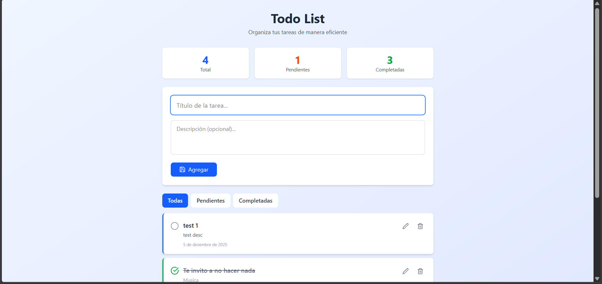
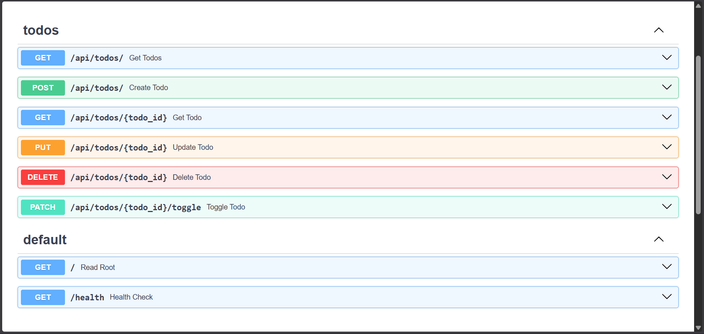
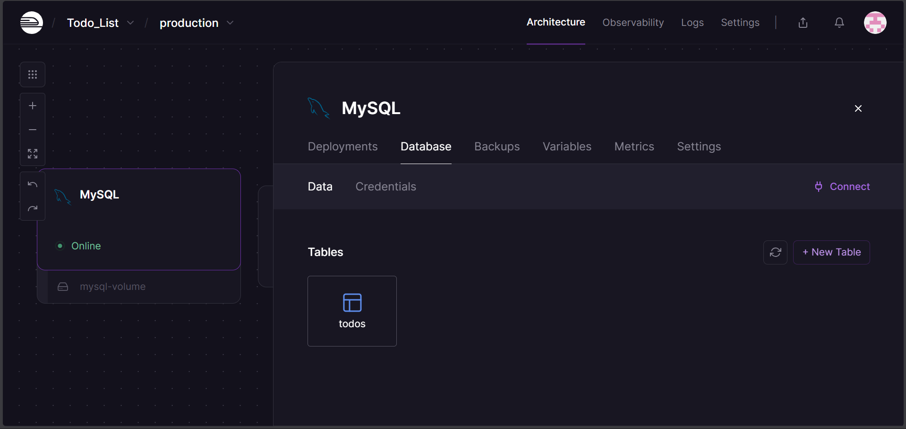

# Todo List - Aplicación de Gestión de Tareas


Aplicación web fullstack para gestionar tareas diarias. Permite crear, editar, eliminar y marcar como completadas las tareas, con filtros intuitivos y una interfaz moderna.

## Tabla de Contenidos

- [Demo en Vivo](#demo-en-vivo)
- [Capturas de Pantalla](#capturas-de-pantalla)
- [Características](#características)
- [Stack Tecnológico](#stack-tecnológico)
- [Estructura del Proyecto](#estructura-del-proyecto)
- [Instalación y Configuración](#instalación-y-configuración)
  - [Requisitos Previos](#requisitos-previos)
  - [Backend](#configuración-del-backend)
  - [Frontend](#configuración-del-frontend)
  - [Base de Datos](#configuración-de-base-de-datos)
- [Ejecución Local](#ejecución-local)
- [Documentación de API](#documentación-de-api)
- [Despliegue](#despliegue)
- [Solución de Problemas](#solución-de-problemas)

---

## Demo en Vivo

- **Frontend (Vercel)**: [https://todo-list-peach-seven-80.vercel.app/](https://todo-list-peach-seven-80.vercel.app/)
- **Backend (Railway)**: [https://todo-list-production-721f.up.railway.app/](https://todo-list-production-721f.up.railway.app/)
- **Documentación API**: [https://todo-list-production-721f.up.railway.app/docs](https://todo-list-production-721f.up.railway.app/docs)

---

## Capturas de Pantalla

### Frontend


### Backend (API Documentation)


### Base de Datos


---

## Características

- Crear, editar y eliminar tareas
- Marcar tareas como completadas
- Filtrar tareas por estado (Todas, Pendientes, Completadas)
- Interfaz responsiva y moderna
- API RESTful documentada con Swagger
- Arquitectura escalable y modular

---

## Stack Tecnológico

### Backend
- **Framework**: FastAPI (Python 3.10+)
- **Base de Datos**: MySQL
- **Conector**: mysql-connector-python
- **Validación**: Pydantic
- **Servidor**: Uvicorn
- **Despliegue**: Railway

### Frontend
- **Framework**: React 18
- **Build Tool**: Vite
- **Estilos**: Tailwind CSS
- **Iconos**: Lucide React
- **HTTP Client**: Fetch API
- **Despliegue**: Vercel

---

## Estructura del Proyecto
```
Todo_List/
│
├── backend/
│   ├── app/
│   │   ├── __init__.py
│   │   ├── database/
│   │   │   ├── __init__.py
│   │   │   └── connection.py       # Configuración de conexión MySQL
│   │   ├── models/
│   │   │   ├── __init__.py
│   │   │   └── todo.py             # Modelos de datos
│   │   ├── routers/
│   │   │   ├── __init__.py
│   │   │   └── todos.py            # Endpoints de la API
│   │   └── schemas/
│   │       ├── __init__.py
│   │       └── todo.py             # Esquemas Pydantic
│   ├── main.py                      # Punto de entrada
│   ├── .env                         # Variables de entorno
│   ├── .env.example                 # Plantilla de variables
│   ├── requirements.txt             # Dependencias Python
│   ├── Procfile                     # Configuración Para el Despliegue en Railway
│
└── src/                             # Frontend
    ├── assets/
    │   └── (imágenes)
    ├── components/
    │   ├── TodoForm.jsx             
    │   └── TodoItem.jsx             
    ├── services/
    │   └── todoService.js           
    ├── App.css
    ├── App.jsx                      
    ├── index.css
    └── main.jsx                     
```

---

## Instalación y Configuración

### Requisitos Previos

Asegúrate de tener instalado:

- **Python 3.10 o superior**: [https://www.python.org/downloads/](https://www.python.org/downloads/)
- **Node.js 16 o superior**: [https://nodejs.org/es/download](https://nodejs.org/es/download)
- **pip**: Verifica con `pip --version`
- **npm**: Verifica con `npm -v`
- **MySQL**: Base de datos (Railway, local, etc.)

### Clonar el Repositorio
```bash
git clone https://github.com/Santixxtt/Todo-List.git
cd Todo_List
```

---

### Configuración del Backend

#### 1. Navega a la carpeta del backend
```bash
cd backend
```

#### 2. Instala las dependencias
```bash
pip install -r requirements.txt
```

#### 3. Configura las variables de entorno

Crea un archivo `.env` en la carpeta `backend/`:
```bash
cp .env.example .env
```

Edita el archivo `.env` con tus credenciales:
```env
DB_HOST=tu-host.railway.app
DB_USER=root
DB_PASSWORD=tu-password
DB_NAME=railway
DB_PORT=3306
```

#### 5. Verifica la conexión a la base de datos

Asegúrate de que tu base de datos MySQL esté configurada y accesible.

---

### Configuración del Frontend

#### 1. Navega a la carpeta raíz del proyecto
```bash
cd ..  # Si estás en backend/
```

#### 2. Instala las dependencias
```bash
npm install
```

#### 3. Instala dependencias adicionales (si no están en package.json)
```bash
npm i -D tailwindcss postcss autoprefixer
npm i lucide-react
```

#### 4. Configura la URL del Backend

Edita el archivo `src/services/todoService.js` y actualiza la URL:

**Para desarrollo local:**
```javascript
const API_URL = 'http://127.0.0.1:8000/api';
```

**Para producción:**
```javascript
const API_URL = 'https://todo-list-production-721f.up.railway.app/api';
```

---

### Configuración de Base de Datos

#### Crear la tabla en MySQL

Ejecuta el siguiente script SQL en tu base de datos:
```sql
CREATE TABLE IF NOT EXISTS todos (
    id INT AUTO_INCREMENT PRIMARY KEY,
    title VARCHAR(255) NOT NULL,
    description TEXT,
    completed BOOLEAN DEFAULT FALSE,
    created_at TIMESTAMP DEFAULT CURRENT_TIMESTAMP,
    updated_at TIMESTAMP DEFAULT CURRENT_TIMESTAMP ON UPDATE CURRENT_TIMESTAMP
);
```

#### Estructura de la tabla

| Columna      | Tipo         | Restricciones/Default                                      |
|--------------|--------------|-----------------------------------------------------------|
| id           | INT          | AUTO_INCREMENT, PRIMARY KEY                               |
| title        | VARCHAR(255) | NOT NULL                                                  |
| description  | TEXT         |                                                           |
| completed    | BOOLEAN      | DEFAULT FALSE                                             |
| created_at   | TIMESTAMP    | DEFAULT CURRENT_TIMESTAMP                                 |
| updated_at   | TIMESTAMP    | DEFAULT CURRENT_TIMESTAMP ON UPDATE CURRENT_TIMESTAMP     |

---

## Ejecución Local

### Ejecutar el Backend
```bash
cd backend
uvicorn app.main:app --reload
```

El servidor estará disponible en: `http://127.0.0.1:8000`

Documentación interactiva (Swagger): `http://127.0.0.1:8000/docs`

### Ejecutar el Frontend

En otra terminal:
```bash
npm run dev
```

El frontend estará disponible en: `http://localhost:5173`

---

## Documentación de API

### Base URL

**Desarrollo**: `http://127.0.0.1:8000/api`
**Producción**: `https://todo-list-production-721f.up.railway.app/api`

### Endpoints

#### 1. GET `/api/todos/` - Obtener todas las tareas

**Descripción**: Retorna un listado de todas las tareas ordenadas por fecha de creación (más reciente primero).

**Respuesta exitosa (200):**
```json
[
  {
    "id": 1,
    "title": "Comprar leche",
    "description": "En el supermercado",
    "completed": false,
    "created_at": "2024-01-15T10:30:00",
    "updated_at": "2024-01-15T10:30:00"
  },
  {
    "id": 2,
    "title": "Hacer ejercicio",
    "description": "30 minutos de cardio",
    "completed": true,
    "created_at": "2024-01-15T09:00:00",
    "updated_at": "2024-01-15T11:00:00"
  }
]
```

---

#### 2. GET `/api/todos/{id}` - Obtener una tarea específica

**Parámetros**:
- `id` (path): ID de la tarea

**Respuesta exitosa (200):**
```json
{
  "id": 1,
  "title": "Comprar leche",
  "description": "En el supermercado",
  "completed": false,
  "created_at": "2024-01-15T10:30:00",
  "updated_at": "2024-01-15T10:30:00"
}
```

**Errores:**
- `404 Not Found` - Tarea no encontrada

---

#### 3. POST `/api/todos/` - Crear una nueva tarea

**Body requerido:**
```json
{
  "title": "Nueva tarea",
  "description": "Descripción opcional"
}
```

**Campos:**
- `title` (string, requerido): Título de la tarea
- `description` (string, opcional): Descripción detallada

**Respuesta exitosa (201):**
```json
{
  "id": 3,
  "title": "Nueva tarea",
  "description": "Descripción opcional",
  "completed": false,
  "created_at": "2024-01-15T10:35:00",
  "updated_at": "2024-01-15T10:35:00"
}
```

**Errores:**
- `400 Bad Request` - El título es requerido o está vacío

---

#### 4. PUT `/api/todos/{id}` - Actualizar una tarea

**Parámetros**:
- `id` (path): ID de la tarea

**Body (todos los campos son opcionales):**
```json
{
  "title": "Tarea actualizada",
  "description": "Nueva descripción",
  "completed": true
}
```

**Respuesta exitosa (200):**
```json
{
  "id": 1,
  "title": "Tarea actualizada",
  "description": "Nueva descripción",
  "completed": true,
  "created_at": "2024-01-15T10:30:00",
  "updated_at": "2024-01-15T11:00:00"
}
```

**Errores:**
- `404 Not Found` - Tarea no encontrada
- `500 Internal Server Error` - Error del servidor

---

#### 5. DELETE `/api/todos/{id}` - Eliminar una tarea

**Parámetros**:
- `id` (path): ID de la tarea

**Respuesta exitosa (200):**
```json
{
  "message": "Tarea eliminada exitosamente",
  "id": 1
}
```

**Errores:**
- `404 Not Found` - Tarea no encontrada

---

#### 6. PATCH `/api/todos/{id}/toggle` - Alternar estado completado

**Descripción**: Cambia el estado de `completed` entre `true` y `false`.

**Parámetros**:
- `id` (path): ID de la tarea

**Respuesta exitosa (200):**
```json
{
  "id": 1,
  "title": "Comprar leche",
  "description": "En el supermercado",
  "completed": true,
  "created_at": "2024-01-15T10:30:00",
  "updated_at": "2024-01-15T11:15:00"
}
```

**Errores:**
- `404 Not Found` - Tarea no encontrada

---

### Códigos de Estado HTTP

| Código | Significado                           |
|--------|---------------------------------------|
| 200    | OK - Operación exitosa                |
| 201    | Created - Recurso creado exitosamente |
| 400    | Bad Request - Datos inválidos         |
| 404    | Not Found - Recurso no encontrado     |
| 500    | Internal Server Error - Error del servidor |

---

## Despliegue

### Backend en Railway

1. Crea una cuenta en [Railway](https://railway.app)
2. Crea un nuevo proyecto y servicio MySQL
3. Crea otro servicio para el backend FastAPI
4. Conecta tu repositorio de GitHub
5. Configura las variables de entorno en Railway:
   - `DB_HOST`
   - `DB_USER`
   - `DB_PASSWORD`
   - `DB_NAME`
   - `DB_PORT`
6. Railway detectará automáticamente el `requirements.txt` y desplegará

**Archivos necesarios:**
- `requirements.txt`
- `Procfile` (opcional)
- `railway.json` (opcional)

### Frontend en Vercel

1. Crea una cuenta en [Vercel](https://vercel.com)
2. Importa tu repositorio de GitHub
3. Vercel detectará automáticamente que es un proyecto Vite/React
4. Actualiza la URL del API en `src/services/todoService.js` con tu URL de Railway
5. Despliega

**Configuración de Vercel (si es necesario):**
```json
{
  "buildCommand": "npm run build",
  "outputDirectory": "dist",
  "framework": "vite"
}
```

---

## Solución de Problemas

### Error de CORS

**Problema**: El frontend no puede conectarse al backend.

**Solución**:
1. Verifica que la URL del backend en `todoService.js` sea correcta
2. Asegúrate de que el backend tenga configurado CORS correctamente
3. En `main.py` debe estar:
```python
app.add_middleware(
    CORSMiddleware,
    allow_origins=["*"],  # O especifica tu dominio de Vercel
    allow_credentials=True,
    allow_methods=["*"],
    allow_headers=["*"],
)
```

### Error de conexión a la base de datos

**Problema**: El backend no puede conectarse a MySQL.

**Solución**:
1. Verifica que las credenciales en `.env` sean correctas
2. Confirma que Railway esté activo y la base de datos esté funcionando
3. Prueba la conexión con un cliente MySQL externo
4. Revisa los logs en Railway para más detalles

### El frontend no muestra las tareas

**Problema**: La interfaz está en blanco o no carga datos.

**Solución**:
1. Verifica que el backend esté corriendo
2. Abre la consola del navegador (F12) para ver errores
3. Verifica que la URL del API en `todoService.js` sea correcta
4. Prueba los endpoints directamente en el navegador o con Postman
5. Revisa que la tabla `todos` exista en la base de datos

### Errores de instalación de dependencias

**Backend**:
```bash
pip install --upgrade pip
pip install -r requirements.txt
```

**Frontend**:
```bash
rm -rf node_modules package-lock.json
npm install
```

### El puerto ya está en uso

**Backend**:
```bash
# Cambia el puerto
uvicorn main:app --reload --port 8001
```

**Frontend**:
```bash
# Vite asignará automáticamente otro puerto
npm run dev
```

---

## Desarrolladores

**Desarrolador 1**: Santiago Tuta

**Desarrolador 2**: Mariana Ruiz